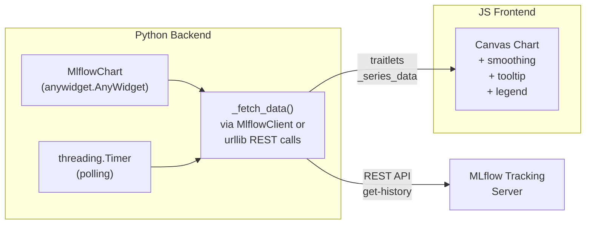

<!-- affae6c0-8021-4036-b5ae-c90d90e1dc1f -->
---
todos:
  - id: "scaffold"
    content: "Project scaffolding: uv init, pyproject.toml, .gitignore, package directories"
    status: pending
  - id: "python-widget"
    content: "Implement MlflowChart Python widget class with data fetching and polling"
    status: pending
  - id: "js-renderer"
    content: "Implement JS canvas chart renderer with smoothing, tooltips, legend"
    status: pending
  - id: "marimo-demo"
    content: "Create Marimo demo notebook with mock MLflow experiment generation"
    status: pending
  - id: "verify"
    content: "End-to-end verification: start MLflow, run demo, check chart renders correctly"
    status: pending
isProject: false
---
# MLflow Chart Widget Package

## Architecture

The WandbChart widget has JS directly calling WandB's GraphQL API from the browser. MLflow's tracking server typically doesn't set CORS headers, so direct browser-to-MLflow fetches would fail in most setups. Instead, we use a **hybrid architecture**: Python fetches data from MLflow (via its REST API or `MlflowClient`), passes it to JS through traitlets, and JS handles rendering + smoothing.



## Package Structure

```
mlflow-chart/                          (workspace root)
├── pyproject.toml                     (uv/hatchling based)
├── README.md
├── .gitignore
├── mlflow_chart/
│   ├── __init__.py                    (exports MlflowChart)
│   ├── chart.py                       (MlflowChart widget class)
│   └── static/
│       └── mlflow-chart.js            (canvas chart renderer)
└── examples/
    └── demo.py                        (Marimo notebook demo)
```

## Step 1: Project Scaffolding

- Use `uv init` to create the project
- Configure `pyproject.toml` with:
  - Build system: `hatchling`
  - Dependencies: `anywidget>=0.9.2`, `traitlets`
  - Optional deps: `[mlflow]` for `mlflow>=2.0`, `[demo]` for `marimo`, `mlflow`
  - Artifacts: `mlflow_chart/static/*`
- Create `.gitignore` for Python/uv

## Step 2: Python Widget (`mlflow_chart/chart.py`)

Key design:
- `MlflowChart(anywidget.AnyWidget)` with traitlets:
  - `tracking_uri` (str) - MLflow server URL, defaults to `MLFLOW_TRACKING_URI` env var or `http://localhost:5000`
  - `experiment_id` (str, optional) - filter by experiment
  - `_runs` (list of dicts with `id` and `label`)
  - `metric_key` (str) - the metric to chart
  - `_series_data` (list of dicts) - data passed to JS: `[{run_id, label, points: [{step, value}]}]`
  - `poll_seconds` (int or None)
  - `smoothing_kind`, `smoothing_param`, `show_slider`
  - `width`, `height`
  - `_status` (str) - status text for JS
- Data fetching strategy:
  - If `mlflow` package is installed: use `MlflowClient.get_metric_history()`
  - Fallback: use `urllib.request` to call `GET /api/2.0/mlflow/metrics/get-history`
- Constructor accepts:
  - `runs` parameter: list of `mlflow.entities.Run` objects or dicts `{id, label}`
  - Or `experiment_id` to auto-discover runs
- Background thread for polling (using `threading.Timer`)
- `refresh()` method for manual refresh
- `stop()` method to stop polling

## Step 3: JS Chart Renderer (`mlflow_chart/static/mlflow-chart.js`)

Adapted from WandbChart's JS, but simplified since data comes via traitlets (no fetch logic):
- Read `_series_data` from model
- Smoothing functions: rolling mean, exponential, gaussian (same as WandbChart)
- Canvas-based chart with:
  - Grid lines, tick labels, title (metric key)
  - Multiple colored polylines (one per run)
  - Raw data behind smoothed lines (low opacity)
  - Hover tooltip (nearest point)
  - Legend (right side)
- Smoothing UI: kind dropdown + slider
- Status line from `_status` traitlet
- Manual refresh button when `poll_seconds` is null
- Reactively redraws when `_series_data` changes

## Step 4: Marimo Demo Notebook (`examples/demo.py`)

- Generate mock MLflow experiments using `mlflow` Python client:
  - Create experiment "demo-training"
  - Run 3 training simulations with different hyperparameters
  - Log `loss`, `accuracy` metrics with realistic curves (exponential decay + noise for loss, sigmoid + noise for accuracy)
- Display `MlflowChart` widgets for `loss` and `accuracy`
- Show smoothing controls in action
- Demonstrate multi-run comparison

## Step 5: Verification

- Start local MLflow server (`mlflow server --port 5000`)
- Run the demo notebook to create mock data
- Verify chart renders correctly with data
- Verify smoothing controls work
- Verify polling updates

## Git Commit Strategy

1. Initial scaffolding (pyproject.toml, .gitignore, package structure)
2. Python widget implementation
3. JS chart renderer
4. Marimo demo notebook
5. Final verification and polish
