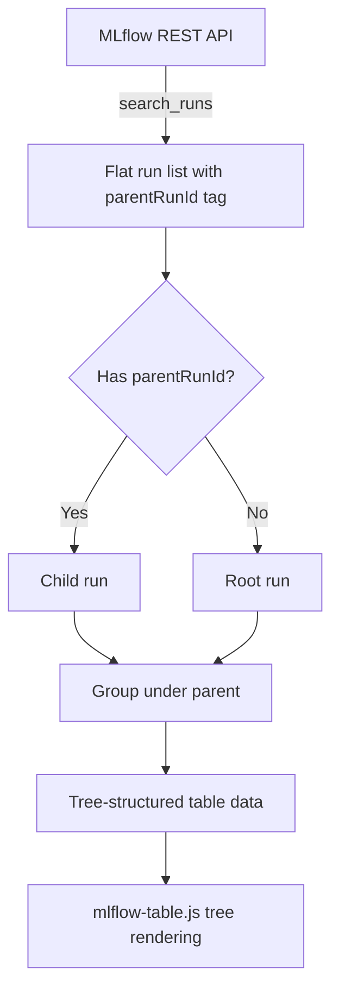
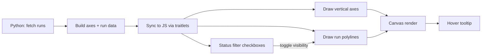

<!-- 68fef715-8312-4634-8aea-b959386749a4 -->
---
todos:
  - id: "nested-backend"
    content: "Add parent_run_id extraction to table.py, chart.py, selector.py (REST + client paths)"
    status: pending
  - id: "nested-table-js"
    content: "Update mlflow-table.js to render runs as a collapsible tree with indentation for child runs"
    status: pending
  - id: "nested-demo"
    content: "Create examples/nested_demo.py with mock parent+child runs"
    status: pending
  - id: "parallel-python"
    content: "Create src/mlflow_widgets/parallel.py with MlflowParallelCoordinates widget"
    status: pending
  - id: "parallel-js"
    content: "Create src/mlflow_widgets/static/mlflow-parallel.js with Canvas-based parallel coordinates chart and status filtering"
    status: pending
  - id: "parallel-demo"
    content: "Create examples/parallel_demo.py with varied hyperparameter runs"
    status: pending
  - id: "exports-readme"
    content: "Update __init__.py exports and README.md with new widgets and demos"
    status: pending
isProject: false
---
# Nested Runs & Parallel Coordinates Chart

## Feature 1: Nested Run Support

### Background

MLflow nested runs use the tag `mlflow.parentRunId` on child runs. The URL `experiments/8/runs/a622c15a...` is a parent run whose child runs reference it via this tag. Currently, `_search_runs_rest` / `_search_runs_detailed_rest` / `_search_runs_detailed_client` do flat searches and ignore the parent/child relationship.

### Changes

#### Python Backend

- **`src/mlflow_widgets/table.py`**: Extract `mlflow.parentRunId` from run tags in both `_search_runs_detailed_rest` and `_search_runs_detailed_client`. Add a `parent_run_id` field to each row dict. Add helper to build a tree structure from flat run list.
- **`src/mlflow_widgets/chart.py`**: Similarly extract `parent_run_id` in `_search_runs_rest`. In `_discover_runs`, optionally filter to only leaf runs or only top-level runs. Add a `flatten_nested` parameter (default `True`) that controls whether child runs are included in charts.
- **`src/mlflow_widgets/selector.py`**: Include `parent_run_id` in the DataFrame output from `to_dataframe()`.

#### JS Frontend

- **`src/mlflow_widgets/static/mlflow-table.js`**: Render runs as a tree with indentation. Parent runs show an expand/collapse toggle. Child runs are indented with a visual connector. Add a "Depth" or "Parent" column or visual indicator.

#### Mock Example

- **`examples/nested_demo.py`**: New Marimo notebook that creates a parent run with 3-4 child runs (e.g., hyperparameter search where each child tests a different config). Shows them in both `MlflowRunTable` (tree view) and `MlflowChart`.

```python
# Nested run pattern:
with mlflow.start_run(run_name="hp-search") as parent:
    mlflow.log_param("search_strategy", "grid")
    for lr in [0.01, 0.05, 0.1]:
        with mlflow.start_run(run_name=f"trial-lr-{lr}", nested=True):
            mlflow.log_param("learning_rate", lr)
            for step in range(100):
                mlflow.log_metric("loss", ..., step=step)
```

### Data Flow for Nested Runs



---

## Feature 2: Parallel Coordinates Chart

### New Widget: `MlflowParallelCoordinates`

A Canvas-based parallel coordinates plot where:
- Each vertical axis represents a parameter or metric
- Each polyline represents a run
- Lines are colored by run status (FINISHED=green, RUNNING=amber, FAILED=red) or by a continuous metric for gradient coloring
- Axes are auto-scaled; categorical params use evenly spaced ticks

### Files

- **`src/mlflow_widgets/parallel.py`**: New Python widget class
  - Traitlets: `_axes_data` (list of axis definitions), `_runs_data` (list of run lines), `_status`, `color_by` (status or metric name), `width`, `height`, `_do_refresh`
  - Reuses `_search_runs_detailed_rest` / `_search_runs_detailed_client` from `table.py` to get params+metrics
  - Builds axis definitions (name, type=numeric|categorical, domain) and run line data
  - Accepts `param_keys` and `metric_keys` lists to select which axes to show, or auto-discovers them

```python
class MlflowParallelCoordinates(anywidget.AnyWidget):
    _esm = Path(__file__).parent / "static" / "mlflow-parallel.js"
    
    _axes_data = traitlets.List(traitlets.Dict()).tag(sync=True)
    _runs_data = traitlets.List(traitlets.Dict()).tag(sync=True)
    _status = traitlets.Unicode("").tag(sync=True)
    color_by = traitlets.Unicode("status").tag(sync=True)
    highlight_status = traitlets.List(traitlets.Unicode()).tag(sync=True)
    width = traitlets.Int(900).tag(sync=True)
    height = traitlets.Int(400).tag(sync=True)
```

- **`src/mlflow_widgets/static/mlflow-parallel.js`**: Canvas rendering
  - Draw vertical axes with labels and tick marks
  - Draw polylines for each run connecting parameter/metric values across axes
  - Status-based coloring with legend
  - Hover tooltip showing run name, all param/metric values
  - Optional: axis reordering by drag, brush filtering on axes
  - Status filter checkboxes (FINISHED, RUNNING, FAILED, KILLED) so users can show/hide runs by state

- **`src/mlflow_widgets/__init__.py`**: Export `MlflowParallelCoordinates`

### Status Differentiation

Runs are colored by status:
- FINISHED: solid green lines (e.g., `#59a14f`)
- RUNNING: dashed amber lines (e.g., `#f28e2b`)
- FAILED: dotted red lines (e.g., `#e15759`)
- KILLED: thin gray lines (e.g., `#bab0ac`)

A checkbox row at the top lets users toggle visibility of each status group. A count badge shows how many runs are in each state.

### Mock Example

- **`examples/parallel_demo.py`**: New Marimo notebook that creates runs with varied hyperparameters and shows the parallel coordinates chart. Include some runs with FAILED status and optionally a RUNNING run.

### Parallel Coordinates Rendering



---

## Summary of Files to Create/Modify

- **Modify**: `src/mlflow_widgets/__init__.py` (add new export)
- **Modify**: `src/mlflow_widgets/table.py` (add `parent_run_id` extraction, tree helpers)
- **Modify**: `src/mlflow_widgets/chart.py` (add `parent_run_id` awareness)
- **Modify**: `src/mlflow_widgets/selector.py` (add `parent_run_id` to DataFrame)
- **Modify**: `src/mlflow_widgets/static/mlflow-table.js` (tree rendering for nested runs)
- **Create**: `src/mlflow_widgets/parallel.py` (new widget)
- **Create**: `src/mlflow_widgets/static/mlflow-parallel.js` (new JS renderer)
- **Create**: `examples/nested_demo.py` (nested runs demo)
- **Create**: `examples/parallel_demo.py` (parallel coordinates demo)
- **Modify**: `README.md` (document new widgets and demos)
