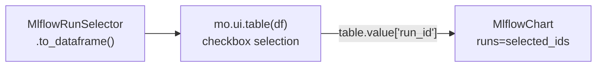

<!-- affae6c0-8021-4036-b5ae-c90d90e1dc1f -->
---
todos:
  - id: "local-tz"
    content: "Change datetime.now(tz=timezone.utc) to datetime.now() in chart.py and table.py"
    status: pending
  - id: "table-poll"
    content: "Add poll_seconds auto-refresh support to MlflowRunTable (Python + JS)"
    status: pending
  - id: "selector"
    content: "Create MlflowRunSelector helper class with to_dataframe() and get_run_ids()"
    status: pending
  - id: "combo-demo"
    content: "Create examples/combo_demo.py showing selector -> mo.ui.table -> MlflowChart flow"
    status: pending
  - id: "verify-combo"
    content: "End-to-end verification of all changes"
    status: pending
isProject: false
---
# Polish and Combo Widget

## 1. Local timezone for update timestamps

Both `chart.py:288` and `table.py:167` currently use UTC:

```python
now = datetime.now(tz=timezone.utc).strftime("%H:%M:%S")
```

Fix: replace with local time via `datetime.now().strftime("%H:%M:%S")` (no `tz` argument = local timezone). This affects two files:
- `src/mlflow_widgets/chart.py` line 288
- `src/mlflow_widgets/table.py` line 167

## 2. Auto-refresh audit

**MlflowChart** already has full auto-refresh support: `poll_seconds` traitlet, `_schedule_poll()`, background `threading.Timer`, and `_poll_tick()` loop. No changes needed.

**MlflowRunTable** is missing auto-refresh. Currently it only supports manual refresh via the `_do_refresh` traitlet button. Need to add:

In `src/mlflow_widgets/table.py`:
- Add `poll_seconds` traitlet (same as chart: `Int(None, allow_none=True)`)
- Add `poll_seconds` constructor parameter
- Add `_poll_timer`, `_poll_lock`, `_stopped` instance vars
- Add `_schedule_poll()`, `_poll_tick()`, `stop()`, `close()` methods (same pattern as `chart.py` lines 301-330)
- Call `_schedule_poll()` in `__init__` when `poll_seconds` is set

In `src/mlflow_widgets/static/mlflow-table.js`:
- Read `poll_seconds` from model
- Show "Auto-refreshing every Ns" in status when active, or show the manual Refresh button when `poll_seconds` is null

## 3. Combo widget: MlflowRunSelector

Create `src/mlflow_widgets/selector.py` with a **pure Python helper class** (NOT an anywidget). This fetches runs and returns them as a pandas DataFrame, which users can then wrap with `mo.ui.table(df, selection="multi")` for checkbox selection in marimo.

```python
class MlflowRunSelector:
    def __init__(self, tracking_uri=None, experiment_id=None):
        ...
    
    def refresh(self):
        """Re-fetch runs from MLflow."""
    
    def to_dataframe(self):
        """Return runs as a pandas DataFrame with columns:
        run_id, run_name, status, start_time, duration_s,
        plus one column per param (param.X) and metric (metric.X).
        """
    
    def get_run_ids(self, df_or_rows):
        """Extract run_id list from a DataFrame or selected rows dict.
        Convenience for feeding into MlflowChart(runs=...).
        """
```

Data flow in marimo (the combo):



Update `src/mlflow_widgets/__init__.py` to export `MlflowRunSelector`.

## 4. Combo demo: `examples/combo_demo.py`

Marimo notebook showing the full workflow:
- Cell: Config (TRACKING_URI)
- Cell: Create mock experiment if needed (reuse pattern from table_demo)
- Cell: `selector = MlflowRunSelector(...)`, `df = selector.to_dataframe()`
- Cell: `table = mo.ui.table(df, selection="multi", label="Select runs to chart")`
- Cell: Guard with `mo.stop(not table.value)`, extract `selected_ids = table.value["run_id"].tolist()`
- Cell: `MlflowChart(runs=selected_ids, metric_key="loss")`
- Cell: `MlflowChart(runs=selected_ids, metric_key="accuracy")`

## Git commits

1. Fix local timezone in both widgets
2. Add auto-refresh (poll_seconds) to MlflowRunTable
3. Add MlflowRunSelector helper class
4. Add combo demo notebook
