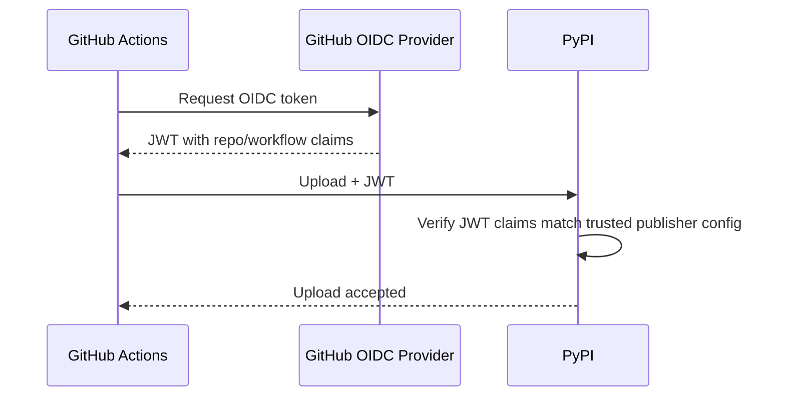

<!-- Generated by SpecStory, Markdown v2.1.0 -->

# 2026-04-01 11:49:36Z

<!-- Codex CLI Session 019d48dc-e8ce-7b42-b387-e21b5d319e92 (2026-04-01 11:49:36Z) -->

_**User (2026-04-01 11:49:36Z)**_

請幫我評估一下 現在這種 Python project documents 推薦什麼方案？
比如 mkdocs-material https://github.com/squidfunk/mkdocs-material
幫我找到現在都有哪些做法 哪個是best practice

我想要更AI native 比如自動能生成llm.txt 或 md https://rspress.rs/guide/basic/ssg-md
但又不要太複雜 且最好大部分 reference都能從code生成 etc. 
然後能有簡單的search
最好可以直接GitHub page host 這樣可以放在GitHub repo description link中

僅調研不要實現 然後總結筆記到 [notes](notes) 


---

_**Agent (gpt-5.4 2026-04-01 11:51:28Z)**_

我先看一下 repo 現況和 `notes/` 結構，再補上最新文件方案的外部調研；這樣可以把建議收斂到適合這個專案，而不是泛泛比較。

_**Agent (gpt-5.4 2026-04-01 11:51:28Z)**_

<tool-use data-tool-type="shell" data-tool-name="exec_command"><details>
<summary>Tool use: **exec_command** `pwd && rg --files .`</summary>
```
Command: /bin/zsh -lc 'pwd && rg --files .'
Chunk ID: 40cff3
Wall time: 0.0000 seconds
Process exited with code 0
Original token count: 202
Output:
/Volumes/Data/Program/tries/2026-04-01-mlflow-chart-wigglystuff
./src/mlflow_widgets/parallel.py
./src/mlflow_widgets/table.py
./src/mlflow_widgets/py.typed
./src/mlflow_widgets/static/mlflow-table.js
./src/mlflow_widgets/static/mlflow-parallel.js
./src/mlflow_widgets/static/mlflow-chart.js
./src/mlflow_widgets/chart.py
./src/mlflow_widgets/__init__.py
./src/mlflow_widgets/selector.py
./AGENTS.md
./examples/nested_demo.py
./examples/combo_demo.py
./examples/demo.py
./examples/parallel_demo.py
./examples/table_demo.py
./examples/live_tracking.py
./notes/publishing-to-pypi.md
./notes/python-agent-skills.md
./README.md
./tests/test_widget_init.py
./tests/test_examples.py
./tests/test_import.py
./tests/__init__.py
./tests/test_packaging.py
./pyproject.toml
./CHANGELOG.md
./LICENSE
./skills-lock.json
```
</details></tool-use>

_**Agent (gpt-5.4 2026-04-01 11:51:28Z)**_

<tool-use data-tool-type="shell" data-tool-name="exec_command"><details>
<summary>Tool use: **exec_command** `find notes -maxdepth 2 -type f | sort`</summary>
```
Command: /bin/zsh -lc 'find notes -maxdepth 2 -type f | sort'
Chunk ID: 0a106f
Wall time: 0.0000 seconds
Process exited with code 0
Original token count: 15
Output:
notes/publishing-to-pypi.md
notes/python-agent-skills.md
```
</details></tool-use>

_**Agent (gpt-5.4 2026-04-01 11:51:28Z)**_

<tool-use data-tool-type="shell" data-tool-name="exec_command"><details>
<summary>Tool use: **exec_command** `sed -n '1,220p' pyproject.toml`</summary>
```
Command: /bin/zsh -lc "sed -n '1,220p' pyproject.toml"
Chunk ID: 1037ff
Wall time: 0.0000 seconds
Process exited with code 0
Original token count: 763
Output:
[project]
name = "mlflow-widgets"
version = "0.1.0"
description = "Anywidget-based notebook widgets for MLflow: live charts, run tables, and more"
readme = "README.md"
authors = [
    { name = "Da-Wei Lee", email = "daviddwlee84@gmail.com" }
]
requires-python = ">=3.10"
license = "MIT"
license-files = ["LICENSE"]
keywords = ["mlflow", "anywidget", "jupyter", "marimo", "visualization", "machine-learning"]
classifiers = [
    "Development Status :: 3 - Alpha",
    "Intended Audience :: Developers",
    "Intended Audience :: Science/Research",
    "Programming Language :: Python :: 3",
    "Programming Language :: Python :: 3.10",
    "Programming Language :: Python :: 3.11",
    "Programming Language :: Python :: 3.12",
    "Programming Language :: Python :: 3.13",
    "Framework :: Jupyter",
    "Topic :: Scientific/Engineering",
    "Topic :: Scientific/Engineering :: Visualization",
]
dependencies = [
    "anywidget>=0.9.2",
    "traitlets",
]

[project.optional-dependencies]
mlflow = [
    "mlflow>=2.0",
    "python-socks[asyncio]>=2.8.1",
]
demo = [
    "marimo>=0.10.0",
    "mlflow>=2.0",
]
dev = [
    "pytest>=8.0",
    "twine>=6.0",
    "ruff>=0.11",
    "taskipy>=1.14",
]

[project.urls]
Homepage = "https://github.com/daviddwlee84/mlflow-widgets"
Repository = "https://github.com/daviddwlee84/mlflow-widgets"
Issues = "https://github.com/daviddwlee84/mlflow-widgets/issues"
Changelog = "https://github.com/daviddwlee84/mlflow-widgets/blob/main/CHANGELOG.md"

[build-system]
requires = ["hatchling"]
build-backend = "hatchling.build"

[tool.hatch.build]
only-packages = true
artifacts = ["src/mlflow_widgets/static/*"]

# -- Task runner (taskipy) --------------------------------------------------

[tool.taskipy.tasks]
test = { cmd = "pytest tests/ -v", help = "Run test suite" }
lint = { cmd = "ruff check src/ tests/", help = "Lint with ruff" }
format = { cmd = "ruff format src/ tests/", help = "Format with ruff" }
check = { cmd = "task lint && task test", help = "Lint + test" }
build = { cmd = "uv build --no-sources", help = "Build sdist + wheel" }
build-check = { cmd = "task build && uvx twine check --strict dist/*", help = "Build and verify metadata" }
publish-test = { cmd = "task build-check && uv publish --publish-url https://test.pypi.org/legacy/", help = "Publish to TestPyPI" }
publish = { cmd = "task build-check && uv publish", help = "Publish to PyPI" }
demo = { cmd = "marimo edit examples/demo.py", help = "Run demo notebook" }
demo-all = { cmd = "marimo edit --watch .", help = "Run all demos with hot-reload" }
clean = { cmd = "rm -rf dist/ build/ *.egg-info src/*.egg-info", help = "Remove build artifacts" }
version = { cmd = "uv version", help = "Show current version" }

# -- Ruff --------------------------------------------------------------------

[tool.ruff]
target-version = "py310"
line-length = 100

[tool.ruff.lint]
select = ["E", "F", "I", "UP", "B", "SIM"]

# -- Pytest ------------------------------------------------------------------

[tool.pytest.ini_options]
testpaths = ["tests"]
```
</details></tool-use>

_**Agent (gpt-5.4 2026-04-01 11:51:38Z)**_

repo 裡目前還沒有 docs site 架構，只有 `README.md`、`CHANGELOG.md` 和兩篇 `notes/*.md`。接著我會看 README 與 API 形狀，再對照現在主流 Python docs stack 的做法與取捨。

_**Agent (gpt-5.4 2026-04-01 11:51:38Z)**_

<tool-use data-tool-type="shell" data-tool-name="exec_command"><details>
<summary>Tool use: **exec_command** `sed -n '1,260p' README.md`</summary>
```
Command: /bin/zsh -lc "sed -n '1,260p' README.md"
Chunk ID: b3404a
Wall time: 0.0000 seconds
Process exited with code 0
Original token count: 1179
Output:
# mlflow-widgets

Anywidget-based notebook widgets for [MLflow](https://mlflow.org/) experiments.

Inspired by [wigglystuff](https://github.com/koaning/wigglystuff)'s [`WandbChart`](https://koaning.github.io/wigglystuff/reference/wandb-chart/), but built for MLflow.

## Installation

```bash
pip install mlflow-widgets
# or with mlflow included:
pip install mlflow-widgets[mlflow]
```

### Install from GitHub (latest)

```bash
# Using uv
uv add git+https://github.com/daviddwlee84/mlflow-widgets.git
# or
uv pip install git+https://github.com/daviddwlee84/mlflow-widgets.git

# Using pip
pip install git+https://github.com/daviddwlee84/mlflow-widgets.git
```

### Install Agent Skill

```bash
npx skils@latest add https://github.com/daviddwlee84/mlflow-widgets
```

## Widgets

### MlflowChart

Live-updating canvas-based line chart for MLflow metrics.

```python
from mlflow_widgets import MlflowChart

chart = MlflowChart(
    tracking_uri="http://localhost:5000",
    experiment_id="1",
    metric_key="loss",
)
chart
```

### MlflowRunTable

Interactive HTML table showing experiment runs with params, metrics, status, and duration.
Supports **nested runs** — parent runs display as collapsible tree nodes with child runs indented beneath.

```python
from mlflow_widgets import MlflowRunTable

table = MlflowRunTable(
    tracking_uri="http://localhost:5000",
    experiment_id="1",
)
table
```

### MlflowParallelCoordinates

Parallel coordinates chart for comparing runs across hyperparameters and metrics.
Each axis is a parameter or metric; each line is a run, colored by status.

```python
from mlflow_widgets import MlflowParallelCoordinates

chart = MlflowParallelCoordinates(
    tracking_uri="http://localhost:5000",
    experiment_id="1",
)
chart
```

## Features

- Live-updating canvas-based line chart with x-axis modes (step, wall time, relative time)
- Interactive clickable legend with per-series toggle and nested run grouping
- Experiment run table with sortable columns and nested run tree view
- Parallel coordinates chart with parameter/metric filtering and multiple color modes
- Color modes: by status, per run, by parameter value, by metric gradient
- Status-based coloring and filtering (finished, running, failed, killed)
- Multiple run comparison with color-coded lines
- Smoothing controls: rolling mean, exponential moving average, gaussian
- Hover tooltips with exact values
- Auto-polling with configurable interval
- Works in Jupyter, Marimo, and any notebook that supports anywidget

## Usage with Marimo

```python
import marimo as mo
from mlflow_widgets import MlflowChart

chart = MlflowChart(
    tracking_uri="http://localhost:5000",
    experiment_id="1",
    metric_key="loss",
)
widget = mo.ui.anywidget(chart)
widget
```

## Demos

See `examples/` for Marimo notebook demos:

- `demo.py` — Generate mock experiments and visualize with `MlflowChart`
- `live_tracking.py` — Track an experiment on-the-fly with live chart updates
- `table_demo.py` — Browse experiment runs with `MlflowRunTable`
- `nested_demo.py` — Parent/child nested runs with tree-view table
- `parallel_demo.py` — Parallel coordinates chart with status filtering

```bash
# Install demo dependencies
pip install mlflow-widgets[demo]

# Start MLflow server
mlflow server --port 5000 &

# Run a demo
marimo edit examples/demo.py

# Run demos (recommend) + auto refresh when editted (by coding agent etc.)
MLFLOW_TRACKING_URI=http://localhost:5000 marimo edit --watch .
```

## Development

### Setup

```bash
# Clone and install all extras (dev + demo + mlflow)
git clone https://github.com/daviddwlee84/mlflow-widgets.git
cd mlflow-widgets
uv sync --all-extras
```

### Task Runner

Common tasks are available via [taskipy](https://github.com/taskipy/taskipy). Run `uv run task --list` to see all tasks:

| Task | Description |
|------|-------------|
| `uv run task test` | Run test suite |
| `uv run task lint` | Lint with ruff |
| `uv run task format` | Format with ruff |
| `uv run task check` | Lint + test |
| `uv run task build` | Build sdist + wheel |
| `uv run task build-check` | Build and verify metadata |
| `uv run task publish-test` | Publish to TestPyPI |
| `uv run task publish` | Publish to PyPI |
| `uv run task demo` | Run demo notebook |
| `uv run task demo-all` | Run all demos with hot-reload |
| `uv run task clean` | Remove build artifacts |
| `uv run task version` | Show current version |

### Release

```bash
# Bump version
uv version --bump patch   # or minor / major

# Build, test, publish
uv run task check
uv run task build-check

# Tag and push (triggers CI publish to PyPI)
git tag v<version>
git push origin v<version>
```

## License

[MIT](LICENSE)
```
</details></tool-use>

_**Agent (gpt-5.4 2026-04-01 11:51:38Z)**_

<tool-use data-tool-type="shell" data-tool-name="exec_command"><details>
<summary>Tool use: **exec_command** `sed -n '1,220p' src/mlflow_widgets/__init__.py`</summary>
```
Command: /bin/zsh -lc "sed -n '1,220p' src/mlflow_widgets/__init__.py"
Chunk ID: 0a8317
Wall time: 0.0000 seconds
Process exited with code 0
Original token count: 127
Output:
"""mlflow-widgets: Anywidget-based notebook widgets for MLflow."""

from __future__ import annotations

from importlib.metadata import version

from mlflow_widgets.chart import MlflowChart
from mlflow_widgets.parallel import MlflowParallelCoordinates
from mlflow_widgets.selector import MlflowRunSelector
from mlflow_widgets.table import MlflowRunTable

__version__ = version("mlflow-widgets")

__all__ = [
    "MlflowChart",
    "MlflowParallelCoordinates",
    "MlflowRunSelector",
    "MlflowRunTable",
]
```
</details></tool-use>

_**Agent (gpt-5.4 2026-04-01 11:51:38Z)**_

<tool-use data-tool-type="shell" data-tool-name="exec_command"><details>
<summary>Tool use: **exec_command** `sed -n '1,220p' notes/publishing-to-pypi.md`</summary>
```
Command: /bin/zsh -lc "sed -n '1,220p' notes/publishing-to-pypi.md"
Chunk ID: 9c4af9
Wall time: 0.0000 seconds
Process exited with code 0
Original token count: 1395
Output:
# Publishing mlflow-widgets to PyPI

My first-time PyPI publish. Notes and learnings for future reference.

## Overview


## 1. Account Setup

### PyPI

1. Create account at <https://pypi.org/account/register/>
2. Enable 2FA (required for new accounts)
3. No need to pre-register the package name -- first upload claims it

### TestPyPI

1. Create **separate** account at <https://test.pypi.org/account/register/>
2. TestPyPI is a completely independent instance (different credentials)

## 2. Trusted Publishing (Recommended)

PyPI supports OIDC-based "Trusted Publishing" so GitHub Actions can publish
without storing long-lived API tokens.

### Setup Steps

On **PyPI** (or TestPyPI), go to:
**Account Settings -> Publishing -> Add a new pending publisher**

Fill in:
- **PyPI Project Name**: `mlflow-widgets`
- **Owner**: `daviddwlee84`
- **Repository name**: `mlflow-widgets`
- **Workflow name**: `publish.yml`
- **Environment name**: `pypi` (or `testpypi` for TestPyPI)

On **GitHub**, create matching environments:
- Repository Settings -> Environments -> New environment
- Create `pypi` and `testpypi` environments
- Optionally add protection rules (e.g., required reviewers for `pypi`)

### How It Works



The workflow needs `permissions: id-token: write` to request the OIDC token.
`uv publish` handles the token exchange automatically.

## 3. License Metadata (PEP 639)

### Old Way (Deprecated)

```toml
license = { text = "MIT" }
# or
license = { file = "LICENSE" }

classifiers = [
    "License :: OSI Approved :: MIT License",
]
```

### New Way (PEP 639 / Metadata 2.4+)

```toml
license = "MIT"                  # SPDX expression string
license-files = ["LICENSE"]      # explicit file listing

# Do NOT include License :: classifiers -- they're deprecated
```

Key points:
- `license` is now a plain SPDX expression string, not a table
- `license-files` explicitly lists which files to include
- `License ::` classifiers are deprecated and may cause warnings
- References: [PEP 639](https://peps.python.org/pep-0639/),
  [Core Metadata Spec](https://packaging.python.org/en/latest/specifications/core-metadata/#license-expression)

## 4. Building with uv

```bash
# Build sdist + wheel
uv build

# Build without tool.uv.sources (recommended for publish verification)
uv build --no-sources

# Build only wheel
uv build --wheel

# Output goes to dist/
```

### Verify the Build

```bash
# Check metadata is valid
uv run twine check --strict dist/*

# Inspect wheel contents
unzip -l dist/*.whl

# Should contain:
#   mlflow_widgets/__init__.py
#   mlflow_widgets/chart.py
#   mlflow_widgets/table.py
#   mlflow_widgets/parallel.py
#   mlflow_widgets/selector.py
#   mlflow_widgets/py.typed
#   mlflow_widgets/static/mlflow-chart.js
#   mlflow_widgets/static/mlflow-table.js
#   mlflow_widgets/static/mlflow-parallel.js
#   mlflow_widgets-0.1.0.dist-info/METADATA
#   mlflow_widgets-0.1.0.dist-info/licenses/LICENSE
```

## 5. Publishing

### First Time: Manual with Token

If Trusted Publishing pending publisher is not set up yet:

```bash
# TestPyPI
uv publish --publish-url https://test.pypi.org/legacy/ --token pypi-AgEI...

# PyPI
uv publish --token pypi-AgEI...
```

Generate tokens at:
- PyPI: Account Settings -> API tokens -> Add API token (scope: entire account for first upload)
- TestPyPI: Same flow on test.pypi.org

### Subsequent: Automated via GitHub Actions

```bash
# Publish to TestPyPI (manual trigger)
# Go to Actions -> "Publish to PyPI" -> Run workflow -> target: testpypi

# Publish to PyPI (tag trigger)
git tag v0.1.0
git push origin v0.1.0
# Workflow triggers automatically
```

### Verify TestPyPI Upload

```bash
# Install from TestPyPI (use --extra-index-url for dependencies from real PyPI)
uv pip install \
    --index-url https://test.pypi.org/simple/ \
    --extra-index-url https://pypi.org/simple/ \
    mlflow-widgets

# Quick smoke test
python -c "from mlflow_widgets import MlflowChart; print('OK')"
```

## 6. Version Management

```bash
# Check current version
uv version

# Set explicit version
uv version 0.2.0

# Bump semantically
uv version --bump patch    # 0.1.0 -> 0.1.1
uv version --bump minor    # 0.1.0 -> 0.2.0
uv version --bump major    # 0.1.0 -> 1.0.0

# Preview without changing
uv version 0.2.0 --dry-run
``
... (truncated)
```
</details></tool-use>

_**Agent (gpt-5.4 2026-04-01 11:52:02Z)**_

我在收斂幾條比較線：`MkDocs Material`、`Sphinx/Furo`、`pdoc`，外加 AI/LLM 友善輸出這一層要怎麼掛上去。接下來我會只查官方文件與 repo，避免被舊 blog post 帶偏。

_**Agent (gpt-5.4 2026-04-01 11:53:39Z)**_

這個 repo 的 public API 很小，適合走「guide + 自動 API reference」而不是大型 portal。我要再確認一下 docstring 與 notebook 範例的成熟度，因為這會直接影響是偏 `MkDocs + mkdocstrings` 還是偏 `Quarto/Jupyter Book`。

_**Agent (gpt-5.4 2026-04-01 11:53:39Z)**_

<tool-use data-tool-type="shell" data-tool-name="exec_command"><details>
<summary>Tool use: **exec_command** `rg -n '^class |^def |^"""|^    """|^        """' src/mlflow_widgets/*.py`</summary>
```
Command: /bin/zsh -lc "rg -n '"'^class |''^def |''^"""|''^    """|''^        """'"' src/mlflow_widgets/*.py"
Chunk ID: 9e0558
Wall time: 0.0000 seconds
Process exited with code 0
Original token count: 1090
Output:
src/mlflow_widgets/__init__.py:1:"""mlflow-widgets: Anywidget-based notebook widgets for MLflow."""
src/mlflow_widgets/parallel.py:1:"""MlflowParallelCoordinates widget for hyperparameter/metric comparison."""
src/mlflow_widgets/parallel.py:21:def _build_axes_and_runs(
src/mlflow_widgets/parallel.py:26:    """Build axis definitions and run data for parallel coordinates.
src/mlflow_widgets/parallel.py:32:    """
src/mlflow_widgets/parallel.py:135:class MlflowParallelCoordinates(anywidget.AnyWidget):
src/mlflow_widgets/parallel.py:136:    """Parallel coordinates chart for comparing runs across params/metrics.
src/mlflow_widgets/parallel.py:151:    """
src/mlflow_widgets/parallel.py:176:        """Create a MlflowParallelCoordinates widget.
src/mlflow_widgets/parallel.py:186:        """
src/mlflow_widgets/parallel.py:204:        """Fetch run data and rebuild axes/run data."""
src/mlflow_widgets/selector.py:1:"""MlflowRunSelector — fetch MLflow runs as a pandas DataFrame for selection."""
src/mlflow_widgets/selector.py:16:class MlflowRunSelector:
src/mlflow_widgets/selector.py:17:    """Fetch MLflow experiment runs and present them as a pandas DataFrame.
src/mlflow_widgets/selector.py:38:    """
src/mlflow_widgets/selector.py:46:        """Create a MlflowRunSelector.
src/mlflow_widgets/selector.py:52:        """
src/mlflow_widgets/selector.py:75:        """Re-fetch runs from MLflow. Returns self for chaining."""
src/mlflow_widgets/selector.py:91:        """Return runs as a pandas DataFrame.
src/mlflow_widgets/selector.py:99:        """
src/mlflow_widgets/selector.py:136:        """Extract run_id list from a DataFrame, list of dicts, or similar.
src/mlflow_widgets/selector.py:147:        """
src/mlflow_widgets/table.py:1:"""MlflowRunTable widget for displaying experiment runs as a sortable table."""
src/mlflow_widgets/table.py:17:def _try_import_mlflow():
src/mlflow_widgets/table.py:25:def _search_runs_detailed_rest(tracking_uri: str, experiment_id: str) -> list[dict]:
src/mlflow_widgets/table.py:26:    """Search runs with full details via REST API."""
src/mlflow_widgets/table.py:76:def _search_runs_detailed_client(client: Any, experiment_id: str) -> list[dict]:
src/mlflow_widgets/table.py:77:    """Search runs with full details using MlflowClient."""
src/mlflow_widgets/table.py:98:class MlflowRunTable(anywidget.AnyWidget):
src/mlflow_widgets/table.py:99:    """Interactive table showing MLflow experiment runs.
src/mlflow_widgets/table.py:114:    """
src/mlflow_widgets/table.py:136:        """Create a MlflowRunTable widget.
src/mlflow_widgets/table.py:145:        """
src/mlflow_widgets/table.py:168:        """Fetch run data from MLflow and update the table."""
src/mlflow_widgets/table.py:213:        """Stop auto-polling."""
src/mlflow_widgets/chart.py:1:"""MlflowChart widget for live MLflow run metric visualization."""
src/mlflow_widgets/chart.py:19:def _try_import_mlflow():
src/mlflow_widgets/chart.py:27:def _fetch_metric_history_rest(
src/mlflow_widgets/chart.py:33:    """Fetch metric history via MLflow REST API using urllib."""
src/mlflow_widgets/chart.py:51:def _fetch_metric_history_client(
src/mlflow_widgets/chart.py:56:    """Fetch metric history using MlflowClient."""
src/mlflow_widgets/chart.py:61:def _get_run_info_rest(tracking_uri: str, run_id: str) -> dict:
src/mlflow_widgets/chart.py:62:    """Fetch run info via REST API."""
src/mlflow_widgets/chart.py:77:def _search_runs_rest(tracking_uri: str, experiment_id: str) -> list[dict]:
src/mlflow_widgets/chart.py:78:    """Search runs in an experiment via REST API."""
src/mlflow_widgets/chart.py:110:class MlflowChart(anywidget.AnyWidget):
src/mlflow_widgets/chart.py:111:    """Live line chart that polls MLflow for metric data.
src/mlflow_widgets/chart.py:133:    """
src/mlflow_widgets/chart.py:166:        """Create a MlflowChart widget.
src/mlflow_widgets/chart.py:184:        """
src/mlflow_widgets/chart.py:223:        """Convert various run formats to a uniform list of {id, label, status}."""
src/mlflow_widgets/chart.py:250:        """Discover all runs in an experiment."""
src/mlflow_widgets/chart.py:275:        """Fetch metric history for all runs and return series data."""
src/mlflow_widgets/chart.py:301:        """Manually refresh metric data from MLflow."""
src/mlflow_widgets/chart.py:338:        """Stop auto-polling."""
```
</details></tool-use>

_**Agent (gpt-5.4 2026-04-01 11:53:39Z)**_

<tool-use data-tool-type="shell" data-tool-name="exec_command"><details>
<summary>Tool use: **exec_command** `sed -n '1,220p' src/mlflow_widgets/chart.py`</summary>
```
Command: /bin/zsh -lc "sed -n '1,220p' src/mlflow_widgets/chart.py"
Chunk ID: 1e2cb8
Wall time: 0.0000 seconds
Process exited with code 0
Original token count: 1895
Output:
"""MlflowChart widget for live MLflow run metric visualization."""

from __future__ import annotations

import json
import os
import threading
import urllib.error
import urllib.request
from collections.abc import Sequence
from datetime import datetime
from pathlib import Path
from typing import Any

import anywidget
import traitlets


def _try_import_mlflow():
    try:
        import mlflow
        return mlflow
    except ImportError:
        return None


def _fetch_metric_history_rest(
    tracking_uri: str,
    run_id: str,
    metric_key: str,
    max_results: int = 25000,
) -> list[dict]:
    """Fetch metric history via MLflow REST API using urllib."""
    base = tracking_uri.rstrip("/")
    url = (
        f"{base}/api/2.0/mlflow/metrics/get-history"
        f"?run_id={run_id}&metric_key={metric_key}&max_results={max_results}"
    )
    req = urllib.request.Request(url, headers={"Accept": "application/json"})
    with urllib.request.urlopen(req, timeout=30) as resp:
        data = json.loads(resp.read().decode())

    metrics = data.get("metrics", [])
    return [
        {"step": int(m.get("step", 0)), "value": float(m["value"]),
         "timestamp": int(m.get("timestamp", 0))}
        for m in metrics
    ]


def _fetch_metric_history_client(
    client: Any,
    run_id: str,
    metric_key: str,
) -> list[dict]:
    """Fetch metric history using MlflowClient."""
    metrics = client.get_metric_history(run_id, metric_key)
    return [{"step": m.step, "value": m.value, "timestamp": m.timestamp} for m in metrics]


def _get_run_info_rest(tracking_uri: str, run_id: str) -> dict:
    """Fetch run info via REST API."""
    base = tracking_uri.rstrip("/")
    url = f"{base}/api/2.0/mlflow/runs/get?run_id={run_id}"
    req = urllib.request.Request(url, headers={"Accept": "application/json"})
    with urllib.request.urlopen(req, timeout=30) as resp:
        data = json.loads(resp.read().decode())
    run = data.get("run", {})
    info = run.get("info", {})
    return {
        "run_id": info.get("run_id", run_id),
        "status": info.get("status", "UNKNOWN"),
        "run_name": info.get("run_name", run_id[:8]),
    }


def _search_runs_rest(tracking_uri: str, experiment_id: str) -> list[dict]:
    """Search runs in an experiment via REST API."""
    base = tracking_uri.rstrip("/")
    url = f"{base}/api/2.0/mlflow/runs/search"
    payload = json.dumps({
        "experiment_ids": [experiment_id],
        "max_results": 100,
    }).encode()
    req = urllib.request.Request(
        url,
        data=payload,
        headers={"Content-Type": "application/json", "Accept": "application/json"},
        method="POST",
    )
    with urllib.request.urlopen(req, timeout=30) as resp:
        data = json.loads(resp.read().decode())

    results = []
    for run in data.get("runs", []):
        info = run.get("info", {})
        run_data = run.get("data", {})
        tags = {}
        for t in run_data.get("tags", []):
            tags[t["key"]] = t["value"]
        results.append({
            "id": info.get("run_id", ""),
            "label": info.get("run_name", info.get("run_id", "")[:8]),
            "status": info.get("status", "UNKNOWN"),
            "parent_run_id": tags.get("mlflow.parentRunId"),
        })
    return results


class MlflowChart(anywidget.AnyWidget):
    """Live line chart that polls MLflow for metric data.

    Renders a Canvas-based chart that can auto-update while runs are active.
    Supports multiple runs for side-by-side comparison and optional rolling
    smoothing (rolling mean, exponential moving average, or gaussian).

    Examples:
        ```python
        import mlflow
        from mlflow_chart import MlflowChart

        with mlflow.start_run() as run:
            for step in range(100):
                mlflow.log_metric("loss", 1.0 / (step + 1), step=step)

            chart = MlflowChart(
                tracking_uri="http://localhost:5000",
                runs=[run],
                metric_key="loss",
            )
            chart
        ```
    """

    _esm = Path(__file__).parent / "static" / "mlflow-chart.js"

    _series_data = traitlets.List(traitlets.Dict()).tag(sync=True)
    _status = traitlets.Unicode("Waiting for data...").tag(sync=True)
    _do_refresh = traitlets.Int(0).tag(sync=True)

    metric_key = traitlets.Unicode("").tag(sync=True)
    poll_seconds = traitlets.Int(5, allow_none=True).tag(sync=True)
    smoothing_kind = traitlets.Unicode("gaussian").tag(sync=True)
    smoothing_param = traitlets.Float(None, allow_none=True).tag(sync=True)
    show_slider = traitlets.Bool(True).tag(sync=True)
    x_axis = traitlets.Unicode("step").tag(sync=True)
    width = traitlets.Int(700).tag(sync=True)
    height = traitlets.Int(300).tag(sync=True)

    def __init__(
        self,
        *,
... (truncated)
```
</details></tool-use>

_**Agent (gpt-5.4 2026-04-01 11:53:39Z)**_

<tool-use data-tool-type="shell" data-tool-name="exec_command"><details>
<summary>Tool use: **exec_command** `sed -n '1,220p' src/mlflow_widgets/table.py`</summary>
```
Command: /bin/zsh -lc "sed -n '1,220p' src/mlflow_widgets/table.py"
Chunk ID: 24bf76
Wall time: 0.0000 seconds
Process exited with code 0
Original token count: 1814
Output:
"""MlflowRunTable widget for displaying experiment runs as a sortable table."""

from __future__ import annotations

import json
import os
import threading
import urllib.request
from datetime import datetime
from pathlib import Path
from typing import Any

import anywidget
import traitlets


def _try_import_mlflow():
    try:
        import mlflow
        return mlflow
    except ImportError:
        return None


def _search_runs_detailed_rest(tracking_uri: str, experiment_id: str) -> list[dict]:
    """Search runs with full details via REST API."""
    base = tracking_uri.rstrip("/")
    url = f"{base}/api/2.0/mlflow/runs/search"
    payload = json.dumps({
        "experiment_ids": [experiment_id],
        "max_results": 200,
    }).encode()
    req = urllib.request.Request(
        url,
        data=payload,
        headers={"Content-Type": "application/json", "Accept": "application/json"},
        method="POST",
    )
    with urllib.request.urlopen(req, timeout=30) as resp:
        data = json.loads(resp.read().decode())

    results = []
    for run in data.get("runs", []):
        info = run.get("info", {})
        run_data = run.get("data", {})

        params = {}
        for p in run_data.get("params", []):
            params[p["key"]] = p["value"]

        metrics = {}
        for m in run_data.get("metrics", []):
            metrics[m["key"]] = m["value"]

        start_ms = int(info.get("start_time", 0))
        end_ms = int(info.get("end_time", 0))
        duration_s = (end_ms - start_ms) / 1000.0 if end_ms > 0 and start_ms > 0 else None

        tags = {}
        for t in run_data.get("tags", []):
            tags[t["key"]] = t["value"]

        results.append({
            "run_id": info.get("run_id", ""),
            "run_name": info.get("run_name", info.get("run_id", "")[:8]),
            "status": info.get("status", "UNKNOWN"),
            "start_time": start_ms,
            "duration_s": duration_s,
            "params": params,
            "metrics": metrics,
            "parent_run_id": tags.get("mlflow.parentRunId"),
        })
    return results


def _search_runs_detailed_client(client: Any, experiment_id: str) -> list[dict]:
    """Search runs with full details using MlflowClient."""
    runs = client.search_runs(experiment_ids=[experiment_id])
    results = []
    for r in runs:
        start_ms = r.info.start_time or 0
        end_ms = r.info.end_time or 0
        duration_s = (end_ms - start_ms) / 1000.0 if end_ms > 0 and start_ms > 0 else None

        results.append({
            "run_id": r.info.run_id,
            "run_name": r.info.run_name or r.info.run_id[:8],
            "status": r.info.status,
            "start_time": start_ms,
            "duration_s": duration_s,
            "params": dict(r.data.params),
            "metrics": {k: v for k, v in r.data.metrics.items()},
            "parent_run_id": r.data.tags.get("mlflow.parentRunId"),
        })
    return results


class MlflowRunTable(anywidget.AnyWidget):
    """Interactive table showing MLflow experiment runs.

    Displays run name, status, start time, duration, parameters, and
    final metric values in a sortable HTML table.

    Examples:
        ```python
        from mlflow_widgets import MlflowRunTable

        table = MlflowRunTable(
            tracking_uri="http://localhost:5000",
            experiment_id="1",
        )
        table
        ```
    """

    _esm = Path(__file__).parent / "static" / "mlflow-table.js"

    _table_data = traitlets.List(traitlets.Dict()).tag(sync=True)
    _param_keys = traitlets.List(traitlets.Unicode()).tag(sync=True)
    _metric_keys = traitlets.List(traitlets.Unicode()).tag(sync=True)
    _status = traitlets.Unicode("Waiting for data...").tag(sync=True)
    _do_refresh = traitlets.Int(0).tag(sync=True)

    poll_seconds = traitlets.Int(None, allow_none=True).tag(sync=True)
    width = traitlets.Int(900).tag(sync=True)

    def __init__(
        self,
        *,
        tracking_uri: str | None = None,
        experiment_id: str | None = None,
        poll_seconds: int | None = None,
        width: int = 900,
        **kwargs: Any,
    ) -> None:
        """Create a MlflowRunTable widget.

        Args:
            tracking_uri: MLflow tracking server URI. Defaults to
                ``MLFLOW_TRACKING_URI`` env var or ``http://localhost:5000``.
            experiment_id: MLflow experiment ID to display runs for.
            poll_seconds: Seconds between auto-refresh, or ``None`` to
                disable auto-polling and show a manual refresh button.
            width: Table width in pixels.
        """
        self._tracking_uri = tracking_uri or os.environ.get(
            "MLFLOW_TRACKING_URI", "http://localhost:5000"
        )
        self._experiment_id = experiment_id
        self._mlflow 
... (truncated)
```
</details></tool-use>

_**Agent (gpt-5.4 2026-04-01 11:55:04Z)**_

<tool-use data-tool-type="unknown" data-tool-name="request_user_input"><details>
<summary>Tool use: **request_user_input**</summary>

**Input:**

- questions: `[map[header:Tooling id:tooling_bias options:[map[description:優先用 Python 生態，降低維護與 CI 複雜度。 label:Python-first (Recommended)] map[description:可接受 Node-based docs stack，只要 AI/UX 更好。 label:Node OK]] question:文件工具鏈你比較偏哪種？] map[header:Content id:content_bias options:[map[description:以套件用法、API reference、安裝與範例導覽為主。 label:API + guides (Recommended)] map[description:更重視教學敘事、執行結果與 notebook 體驗。 label:Notebook/tutorial first] map[description:以從 code 自動生出的 reference 為主，手寫內容少。 label:Mostly API reference]] question:這份文件你希望主要服務哪種內容？]]`

**Result:**

</details></tool-use>

_**Agent (gpt-5.4 2026-04-01 12:03:59Z)**_

需求已經夠清楚了，我可以把方案定稿：你的 case 不是「文件平台 showcase」，而是「小到中型 Python library 的 guide + API reference + GitHub Pages + 簡單 search，再加上 AI-friendly 輸出」。在這組約束下，主推薦其實已經很明確。

---

_**User (2026-04-01 12:07:39Z)**_

PLEASE IMPLEMENT THIS PLAN:
# Python Docs Stack Recommendation for `mlflow-widgets`

## Summary

- **Recommended default for this repo:** `MkDocs + Material for MkDocs + mkdocstrings[python]`
- **AI-native add-on strategy:** treat `llms.txt` / `.md` mirrors as an additive artifact, not the core driver of the stack choice
- **Fallback if AI-native output must be first-class and Python-first:** `Sphinx + Furo + MyST + autodoc/apidoc + sphinx-llm`
- **Not recommended as primary stack here:** `Rspress` or `pdoc`

This recommendation is an **inference** from current official docs plus this repo’s shape:
- repo is a small Python package with a narrow public API
- existing docs are mostly Markdown (`README.md`, `notes/*.md`)
- public API already has usable docstrings
- desired content is mainly **API + guides**, not notebook-first publishing
- GitHub Pages hosting and simple search are required
- low complexity matters more than having the most “AI-native” stack possible

## Recommended Stack

### Primary choice: MkDocs Material
Use:
- `mkdocs`
- `mkdocs-material`
- `mkdocstrings[python]`
- optionally `mkdocs-gen-files` only if API pages should be auto-generated from module lists

Why this is the best fit:
- Markdown-first authoring, which matches the repo’s current docs style
- built-in client-side search in Material, no external service required
- easy GitHub Pages deployment from static output
- Python API reference can be pulled directly from code/docstrings with `::: module.object`
- simpler than Sphinx for a package of this size

Recommended content model:
- hand-written guides for install / quickstart / live MLflow setup / Marimo usage / examples
- one API reference section generated from the public objects in `mlflow_widgets`
- examples pages derived from the existing `examples/*.py` notebooks/scripts, but summarized rather than fully duplicated

### AI-native layer for the recommended stack
For MkDocs, do **not** make the whole architecture depend on `llms.txt`.

Preferred approach:
- keep the docs stack as MkDocs Material
- generate `llms.txt` and optionally `llms-full.txt` as a post-build artifact

Default choice:
- prefer a **small custom post-build script** over hard-coupling to a niche plugin

Reason:
- `mkdocs-llmstxt` exists, but its GitHub README currently says it is in **maintenance mode**
- it also generates Markdown by cleaning HTML and converting it back to Markdown, which is pragmatic but less direct than native Markdown rendering

## Alternatives and When to Choose Them

### Sphinx + Furo + MyST + `sphinx-llm`
Choose this only if:
- AI-facing artifacts are a hard requirement from day one
- you want the strongest Python-docs ecosystem integration
- you accept more config and maintenance overhead

Why it is strong:
- Sphinx autodoc/apidoc/autosummary remain the deepest Python-docs toolchain
- MyST allows Markdown authoring instead of forcing pure reStructuredText
- `sphinx-llm` can generate `llms.txt`, `llms-full.txt`, and per-page Markdown alongside HTML

Why it is not the default here:
- more moving parts than MkDocs
- heavier for a small library with a compact API surface

### Rspress
Treat this as a deliberate exception, not best practice for this repo.

Use only if:
- Node/React/MDX tooling is acceptable
- AI-native publishing is more important than Python-native API extraction
- docs are becoming product-like frontend docs rather than package docs

Why it is interesting:
- built-in full-text search
- built-in `llms.txt`, `llms-full.txt`, and per-route `.md`
- GitHub Pages deployment is documented

Why it is not recommended here:
- Python reference generation is not first-class
- you would still need a separate Python API-doc generation step
- its `llms`/SSG-MD feature is explicitly marked **experimental**

### pdoc
Do not choose this as the main site stack.

Use only if:
- you want a very small, mostly API-reference site
- you accept limited information architecture

Why it loses here:
- pdoc itself says its main use case is API documentation and recommends Sphinx for more complex needs
- HTML-only output
- weaker fit for guide + reference hybrid docs

## Notes File to Produce

Create one research note at:

- `notes/docs-stack-evaluation.md`

The note should contain:
- final recommendation
- decision criteria
- comparison table: `MkDocs Material`, `Sphinx/Furo`, `pdoc`, `Quarto`, `Rspress`
- “best practice for this repo” section
- AI-native guidance:
  `llms.txt` is a bonus artifact, not the primary selection criterion
- suggested future implementation path:
  `MkDocs Material + mkdocstrings`, then add `llms.txt` generation afterward
- source links

## Test / Validation Criteria

The note is complete when it:
- clearly states one primary recommendation, one fallback, and what not to choose
- maps each option to the repo’s actual constraints
- distinguishes **current ecosystem facts** from **my recommendation/inference**
- includes source links for the official docs and plugin/project pages used
- explicitly calls out the maintenance/experimental status of the AI-native add-ons where relevant

## Assumptions and Defaults

- Language of the note: Traditional Chinese
- Hosting target: GitHub Pages via GitHub Actions
- Content bias: API reference plus concise guides, not notebook-first publishing
- Tooling bias: Python-first, but Node-based options should still be evaluated briefly
- AI-native requirement: desirable, but not worth a large complexity penalty
- Search requirement: simple built-in search is sufficient; no Algolia required

## Sources

- MkDocs deploy: [mkdocs.org](https://www.mkdocs.org/user-guide/deploying-your-docs/)
- Material search: [squidfunk.github.io/mkdocs-material/plugins/search](https://squidfunk.github.io/mkdocs-material/plugins/search/)
- mkdocstrings Python usage: [mkdocstrings.github.io/python/usage](https://mkdocstrings.github.io/python/usage/)
- Sphinx autodoc: [sphinx-doc.org](https://www.sphinx-doc.org/en/master/usage/extensions/autodoc.html)
- Sphinx apidoc: [sphinx-doc.org](https://www.sphinx-doc.org/en/master/usage/extensions/apidoc.html)
- Furo: [pradyunsg.me/furo](https://pradyunsg.me/furo/)
- MyST Parser: [myst-parser.readthedocs.io](https://myst-parser.readthedocs.io/en/latest/)
- pdoc: [pdoc.dev](https://pdoc.dev/) and [pdoc limitations](https://pdoc.dev/docs/pdoc.html)
- Quarto search / GitHub Pages: [quarto.org](https://quarto.org/docs/websites/website-search.html), [quarto.org](https://quarto.org/docs/publishing/github-pages.html)
- Rspress intro / llms / deploy: [rspress.rs](https://rspress.rs/guide/start/introduction), [rspress.rs](https://rspress.rs/guide/basic/ssg-md), [rspress.rs](https://rspress.rs/zh/guide/basic/deploy)
- MkDocs llms plugin: [github.com/pawamoy/mkdocs-llmstxt](https://github.com/pawamoy/mkdocs-llmstxt)
- Sphinx llms extension: [pypi.org/project/sphinx-llm](https://pypi.org/project/sphinx-llm/)
- GitHub Pages custom workflows: [docs.github.com](https://docs.github.com/en/pages/getting-started-with-github-pages/using-custom-workflows-with-github-pages)
- OpenAI crawler docs: [developers.openai.com/api/docs/bots](https://developers.openai.com/api/docs/bots)


---

_**Agent (gpt-5.4 2026-04-01 12:08:02Z)**_

我先把外部來源補齊成可引用的事實，再落成一篇中文研究筆記到 `notes/`。重點會是把「生態現況」和「對這個 repo 的建議」分開寫清楚。

_**Agent (gpt-5.4 2026-04-01 12:08:41Z)**_

來源已經夠了。我現在把研究結果整理成一篇可直接留在 repo 的中文筆記，會包含比較表、best practice 結論、AI-native 補充，以及後續若要落地的最小路徑。

_**Agent (gpt-5.4 2026-04-01 12:09:28Z)**_

<tool-use data-tool-type="write" data-tool-name="apply_patch"><details>
<summary>Tool use: **apply_patch**</summary>
**Add: `/Volumes/Data/Program/tries/2026-04-01-mlflow-chart-wigglystuff/notes/docs-stack-evaluation.md`**

```diff
+# Python 專案文件方案評估：`mlflow-widgets`
+
+日期：2026-04-01
+
+## 結論先行
+
+對這個 repo，我的主推薦是：
+
+- `MkDocs + Material for MkDocs + mkdocstrings[python]`
+
+備選方案：
+
+- 如果未來把 `llms.txt` / 每頁 `.md` 輸出當成一級需求，而且仍想留在 Python docs 生態，選 `Sphinx + Furo + MyST + autodoc/apidoc + sphinx-llm`
+
+不建議作為本 repo 主方案：
+
+- `Rspress`
+- `pdoc`
+
+這個結論是根據目前 repo 形狀與官方文件做出的判斷，不是抽象地選「最強 docs 平台」。
+
+## 這個 repo 的現況
+
+從 repo 內容來看，這是一個很典型的「小到中型 Python library docs」案例：
+
+- public API 很小，`src/mlflow_widgets/__init__.py` 目前只匯出 `MlflowChart`、`MlflowParallelCoordinates`、`MlflowRunSelector`、`MlflowRunTable`
+- 既有文件主要是 Markdown，像 `README.md`、`CHANGELOG.md`、`notes/*.md`
+- 核心 Python 類別已有 docstring，可直接餵給 API reference 生成器
+- `examples/` 以 Marimo / Python script 為主，不是 notebook portal 型產品文件
+- 需求偏向「guide + API reference + examples 索引」，不是大型多產品 docs portal
+
+所以最重要的不是 framework 花樣，而是：
+
+- Markdown 寫作順手
+- API reference 可從 code 生成
+- 有基本 search
+- GitHub Pages 好部署
+- 之後可以低成本補 AI-friendly artifacts
+
+## 評估準則
+
+本次評估使用以下準則：
+
+- Python package 文件是否是第一級使用情境
+- 能否從 docstring / module 結構直接生成 API reference
+- 是否適合 Markdown-first 工作流
+- 是否自帶或容易提供簡單搜尋
+- 是否容易部署到 GitHub Pages
+- 是否能低摩擦補上 `llms.txt` / `llms-full.txt` / `.md` 輸出
+- 維護成本是否合理
+
+## 方案比較
+
+| 方案 | Python API 自動生成 | Markdown-first | 搜尋 | AI-native 輸出 | GitHub Pages | 複雜度 | 對本 repo 的適配 |
+| --- | --- | --- | --- | --- | --- | --- | --- |
+| `MkDocs + Material + mkdocstrings` | 強 | 強 | 強 | 中，需額外補 | 強 | 低 | 最佳 |
+| `Sphinx + Furo + MyST + sphinx-llm` | 很強 | 中到強 | 強 | 強 | 強 | 中到高 | 次佳 |
+| `pdoc` | 中到強 | 弱 | 中 | 弱 | 強 | 很低 | 偏弱 |
+| `Quarto` | 中 | 強 | 強 | 弱到中 | 強 | 中 | 可用但不是最佳 |
+| `Rspress` | 弱到中 | 強 | 強 | 很強 | 強 | 中 | 不適合作為主方案 |
+
+## 各方案判斷
+
+### 1. MkDocs Material + mkdocstrings
+
+這是我認為目前最符合 Python library best practice 的方案。
+
+原因：
+
+- `Material for MkDocs` 內建 search plugin，不需要另外安裝搜尋套件
+- `mkdocstrings` 的 Python handler 可以直接在 Markdown 裡用 `::: path.to.object` 注入 API docs
+- `mkdocstrings` 官方對 `src/` layout 也有明確建議，推薦用 `paths: [src]`
+- MkDocs 本身就是靜態站，放 GitHub Pages 非常直接
+- 對現有 Markdown 文件最友好，導入成本最低
+
+對這個 repo 尤其適合的點：
+
+- 你不需要大型 Sphinx 生態才有的複雜 cross-project 文檔功能
+- public API 不大，用 `mkdocstrings` 足夠
+- guides 與 notes 已經是 Markdown，幾乎不用改作者習慣
+
+我的判斷：
+
+- 這是目前最穩、最省、最符合 repo 尺寸的主方案
+
+### 2. Sphinx + Furo + MyST + sphinx-llm
+
+這是最合理的 Python-first AI-native 備案。
+
+優點：
+
+- `sphinx.ext.autodoc` 可直接從 docstring 拉文件
+- `sphinx.ext.apidoc` 可以從 Python package 自動產生 API docs source
+- `MyST` 讓 Sphinx 也能舒服地吃 Markdown
+- `Furo` 對小到中型 docset 的閱讀體驗很好
+- `sphinx-llm` 可以生成 `llms.txt`、`llms-full.txt`，也能輸出每頁 Markdown
+
+缺點：
+
+- 設定面和維護成本明顯高於 MkDocs
+- `autodoc` 會 import 你的 module，若 import 有 side effects 要額外注意
+- 對這種 API 面積不大的套件來說，常常有點 overkill
+
+我的判斷：
+
+- 如果未來真的把 AI-facing output 當成核心能力，而不是附加 artifact，這會是最合理的升級路線
+- 但以現在這個 repo，仍然不是第一選擇
+
+### 3. pdoc
+
+`pdoc` 的定位其實很清楚：它主要是 API documentation 工具。
+
+優點：
+
+- 幾乎零設定
+- 對 type annotations 與 docstring 支援不錯
+- 很快就能有一套可看的 API docs
+
+缺點：
+
+- 官方文件直接說它的主要 use case 是 API docs；如果需求更複雜，建議用 Sphinx
+- 官方文件也明講它只支援 HTML output
+- guide / conceptual docs / 多層資訊架構不是它的強項
+
+我的判斷：
+
+- 若這個 repo 只想做極簡 API docs，`pdoc` 可以
+- 但你現在要的是 guide + API + GitHub Pages + AI-native 延伸，`pdoc` 太窄
+
+### 4. Quarto
+
+Quarto 不是壞選擇，但不是這個 repo 的最佳選擇。
+
+優點：
+
+- 官方有 built-in full-text search
+- GitHub Pages 部署成熟
+- 很適合 notebook、教學、報告、研究導向內容
+
+限制：
+
+- 它不是以 Python package API docs 為核心設計
+- API reference 這件事通常需要你再疊其他工具或自己整合
+- 對 library docs 來說，常常不是最短路徑
+
+我的判斷：
+
+- 如果未來 docs 方向變成 notebook/tutorial first，Quarto 的吸引力會上升
+- 但對當前 `mlflow-widgets`，仍不如 MkDocs 直接
+
+### 5. Rspress
+
+Rspress 很有意思，但我不建議拿它當這個 repo 的主 docs stack。
+
+優點：
+
+- 內建全文搜尋
+- 官方已提供 `llms.txt`、`llms-full.txt`、每頁 `.md` 的能力
+- GitHub Pages 部署有官方指引
+
+限制：
+
+- 它是 Node / frontend-first 的文件框架，不是 Python package docs first
+- Python API reference 仍要靠外部工具補
+- 官方把 `llms` 的 SSG-MD 功能標成 experimental
+
+我的判斷：
+
+- 若你是做 framework / frontend product docs，Rspress 值得考慮
+- 對這個 repo，為了拿 AI-native 輸出去換掉整個 Python-friendly docs 工具鏈，不划算
+
+## AI-native 的實務建議
+
+我的建議是把 AI-native 能力拆成兩層：
+
+### 第一層：先把 HTML docs stack 選對
+
+主站先選：
+
+- `MkDocs + Material + mkdocstrings`
+
+理由：
+
+- 這決定的是日常維護成本
+- 這也決定你能不能穩定地從 code 生成 reference
+
+### 第二層：再補 AI-facing artifacts
+
+之後再補：
+
+- `llms.txt`
+- `llms-full.txt`
+- 若需要，再補每頁 `.md`
+
+這些應該被視為附加輸出，而不是主架構選型的核心驅動。
+
+原因：
+
+- `mkdocs-llmstxt` 雖然能做這件事，但它的 GitHub README 目前明確寫著 maintenance mode
+- 它是合理工具，但不值得讓整個 docs stack 綁死在它上面
+- 對這個 repo，更穩的做法是之後用小型自訂 post-build script 產出 `llms.txt`
+
+### 額外提醒：`llms.txt` 不是全部
+
+如果之後要更「AI native」，除了 `llms.txt`，也要一起考慮：
+
+- `robots.txt`
+- crawler / bot policy
+- 穩定的靜態 URL 結構
+- 每頁內容是否夠乾淨、可抽取、可索引
+
+這點的理由是：OpenAI 官方文件目前明確提到 `OAI-SearchBot` 與 `GPTBot` 的 `robots.txt` 控制方式。換句話說，AI 可見性不只取決於你有沒有 `llms.txt`，也和爬蟲可達性有關。
+
+## 對這個 repo 的 best practice
+
+如果以「2026 年現在的小到中型 Python library docs」來看，我認為這個 repo 的 best practice 是：
+
+1. 主站使用 `MkDocs + Material`
+2. API reference 使用 `mkdocstrings[python]`
+3. guides 以 Markdown 手寫，內容聚焦：
+   - installation
+   - quickstart
+   - MLflow server setup
+   - Marimo / Jupyter usage
+   - examples overview
+4. API 頁只針對 public API 輸出，不追求把所有 internal helper 都曝光
+5. GitHub Pages 用 GitHub Actions custom workflow 部署
+6. `llms.txt` 作為第二階段 artifact，而不是第一階段 blocking requirement
+
+這組做法的核心精神是：
+
+- 主 docs stack 保持 Python-first
+- reference 盡量從 code 生成
+- AI-friendly output 用附加層補上
+
+## 建議的後續實作路徑
+
+如果之後要實作，我建議順序如下：
+
+### Phase 1
+
+- 建 `docs/`
+- 上 `mkdocs.yml`
+- 用 `Material for MkDocs`
+- 建首頁、安裝、快速開始、examples、API reference
+- API reference 只接 public API
+
+### Phase 2
+
+- 補 examples 導覽頁
+- 補 GitHub Pages workflow
+- 調整 nav、search、social preview、repo links
+
+### Phase 3
+
+- 用小型 post-build script 生成 `llms.txt`
+- 視需求再補 `llms-full.txt`
+- 若未來 AI-native 比重明顯上升，再重新評估是否要升級到 `Sphinx + sphinx-llm`
+
+## 最終建議
+
+一句話版本：
+
+- **現在就選 `MkDocs + Material + mkdocstrings`**
+- **把 `llms.txt` 當成第二階段補件**
+- **只有在 AI-facing markdown artifact 成為核心需求時，才考慮切到 `Sphinx + Furo + MyST + sphinx-llm`**
+
+## 來源
+
+- MkDocs deploy: <https://www.mkdocs.org/user-guide/deploying-your-docs/>
+- Material search: <https://squidfunk.github.io/mkdocs-material/plugins/search/>
+- mkdocstrings Python usage: <https://mkdocstrings.github.io/python/usage/>
+- Sphinx autodoc: <https://www.sphinx-doc.org/en/master/usage/extensions/autodoc.html>
+- Sphinx apidoc: <https://www.sphinx-doc.org/en/master/usage/extensions/apidoc.html>
+- Furo: <https://pradyunsg.me/furo/>
+- MyST Parser: <https://myst-parser.readthedocs.io/en/latest/>
+- pdoc: <https://pdoc.dev/>
+- pdoc limitations: <https://pdoc.dev/docs/pdoc.html>
+- Quarto website search: <https://quarto.org/docs/websites/website-search.html>
+- Quarto GitHub Pages: <https://quarto.org/docs/publishing/github-pages.html>
+- Rspress introduction: <https://rspress.rs/guide/start/introduction>
+- Rspress `llms.txt` / SSG-MD: <https://rspress.rs/guide/basic/ssg-md>
+- Rspress deploy: <https://rspress.rs/guide/basic/deploy>
+- `mkdocs-llmstxt`: <https://github.com/pawamoy/mkdocs-llmstxt>
+- `sphinx-llm`: <https://pypi.org/project/sphinx-llm/>
+- GitHub Pages custom workflows: <https://docs.github.com/en/pages/getting-started-with-github-pages/using-custom-workflows-with-github-pages>
+- OpenAI crawler docs: <https://developers.openai.com/api/docs/bots>
```
</details></tool-use>

_**Agent (gpt-5.4 2026-04-01 12:09:41Z)**_

筆記已寫入。我現在做一次快速自檢，確認內容有包含比較表、best practice、AI-native 補充與來源清單，避免漏掉你要求的欄位。

_**Agent (gpt-5.4 2026-04-01 12:09:42Z)**_

<tool-use data-tool-type="shell" data-tool-name="exec_command"><details>
<summary>Tool use: **exec_command** `sed -n '1,260p' notes/docs-stack-evaluation.md`</summary>
```
Command: /bin/zsh -lc "sed -n '1,260p' notes/docs-stack-evaluation.md"
Chunk ID: cce64c
Wall time: 0.0000 seconds
Process exited with code 0
Original token count: 2128
Output:
# Python 專案文件方案評估：`mlflow-widgets`

日期：2026-04-01

## 結論先行

對這個 repo，我的主推薦是：

- `MkDocs + Material for MkDocs + mkdocstrings[python]`

備選方案：

- 如果未來把 `llms.txt` / 每頁 `.md` 輸出當成一級需求，而且仍想留在 Python docs 生態，選 `Sphinx + Furo + MyST + autodoc/apidoc + sphinx-llm`

不建議作為本 repo 主方案：

- `Rspress`
- `pdoc`

這個結論是根據目前 repo 形狀與官方文件做出的判斷，不是抽象地選「最強 docs 平台」。

## 這個 repo 的現況

從 repo 內容來看，這是一個很典型的「小到中型 Python library docs」案例：

- public API 很小，`src/mlflow_widgets/__init__.py` 目前只匯出 `MlflowChart`、`MlflowParallelCoordinates`、`MlflowRunSelector`、`MlflowRunTable`
- 既有文件主要是 Markdown，像 `README.md`、`CHANGELOG.md`、`notes/*.md`
- 核心 Python 類別已有 docstring，可直接餵給 API reference 生成器
- `examples/` 以 Marimo / Python script 為主，不是 notebook portal 型產品文件
- 需求偏向「guide + API reference + examples 索引」，不是大型多產品 docs portal

所以最重要的不是 framework 花樣，而是：

- Markdown 寫作順手
- API reference 可從 code 生成
- 有基本 search
- GitHub Pages 好部署
- 之後可以低成本補 AI-friendly artifacts

## 評估準則

本次評估使用以下準則：

- Python package 文件是否是第一級使用情境
- 能否從 docstring / module 結構直接生成 API reference
- 是否適合 Markdown-first 工作流
- 是否自帶或容易提供簡單搜尋
- 是否容易部署到 GitHub Pages
- 是否能低摩擦補上 `llms.txt` / `llms-full.txt` / `.md` 輸出
- 維護成本是否合理

## 方案比較

| 方案 | Python API 自動生成 | Markdown-first | 搜尋 | AI-native 輸出 | GitHub Pages | 複雜度 | 對本 repo 的適配 |
| --- | --- | --- | --- | --- | --- | --- | --- |
| `MkDocs + Material + mkdocstrings` | 強 | 強 | 強 | 中，需額外補 | 強 | 低 | 最佳 |
| `Sphinx + Furo + MyST + sphinx-llm` | 很強 | 中到強 | 強 | 強 | 強 | 中到高 | 次佳 |
| `pdoc` | 中到強 | 弱 | 中 | 弱 | 強 | 很低 | 偏弱 |
| `Quarto` | 中 | 強 | 強 | 弱到中 | 強 | 中 | 可用但不是最佳 |
| `Rspress` | 弱到中 | 強 | 強 | 很強 | 強 | 中 | 不適合作為主方案 |

## 各方案判斷

### 1. MkDocs Material + mkdocstrings

這是我認為目前最符合 Python library best practice 的方案。

原因：

- `Material for MkDocs` 內建 search plugin，不需要另外安裝搜尋套件
- `mkdocstrings` 的 Python handler 可以直接在 Markdown 裡用 `::: path.to.object` 注入 API docs
- `mkdocstrings` 官方對 `src/` layout 也有明確建議，推薦用 `paths: [src]`
- MkDocs 本身就是靜態站，放 GitHub Pages 非常直接
- 對現有 Markdown 文件最友好，導入成本最低

對這個 repo 尤其適合的點：

- 你不需要大型 Sphinx 生態才有的複雜 cross-project 文檔功能
- public API 不大，用 `mkdocstrings` 足夠
- guides 與 notes 已經是 Markdown，幾乎不用改作者習慣

我的判斷：

- 這是目前最穩、最省、最符合 repo 尺寸的主方案

### 2. Sphinx + Furo + MyST + sphinx-llm

這是最合理的 Python-first AI-native 備案。

優點：

- `sphinx.ext.autodoc` 可直接從 docstring 拉文件
- `sphinx.ext.apidoc` 可以從 Python package 自動產生 API docs source
- `MyST` 讓 Sphinx 也能舒服地吃 Markdown
- `Furo` 對小到中型 docset 的閱讀體驗很好
- `sphinx-llm` 可以生成 `llms.txt`、`llms-full.txt`，也能輸出每頁 Markdown

缺點：

- 設定面和維護成本明顯高於 MkDocs
- `autodoc` 會 import 你的 module，若 import 有 side effects 要額外注意
- 對這種 API 面積不大的套件來說，常常有點 overkill

我的判斷：

- 如果未來真的把 AI-facing output 當成核心能力，而不是附加 artifact，這會是最合理的升級路線
- 但以現在這個 repo，仍然不是第一選擇

### 3. pdoc

`pdoc` 的定位其實很清楚：它主要是 API documentation 工具。

優點：

- 幾乎零設定
- 對 type annotations 與 docstring 支援不錯
- 很快就能有一套可看的 API docs

缺點：

- 官方文件直接說它的主要 use case 是 API docs；如果需求更複雜，建議用 Sphinx
- 官方文件也明講它只支援 HTML output
- guide / conceptual docs / 多層資訊架構不是它的強項

我的判斷：

- 若這個 repo 只想做極簡 API docs，`pdoc` 可以
- 但你現在要的是 guide + API + GitHub Pages + AI-native 延伸，`pdoc` 太窄

### 4. Quarto

Quarto 不是壞選擇，但不是這個 repo 的最佳選擇。

優點：

- 官方有 built-in full-text search

... (truncated)
```
</details></tool-use>

_**Agent (gpt-5.4 2026-04-01 12:09:58Z)**_

我補一小段，把「上游現況事實」和「對這個 repo 的推薦」明確分開，這樣筆記更符合你原先的驗收條件。

_**Agent (gpt-5.4 2026-04-01 12:10:04Z)**_

<tool-use data-tool-type="write" data-tool-name="apply_patch"><details>
<summary>Tool use: **apply_patch**</summary>
**Update: `/Volumes/Data/Program/tries/2026-04-01-mlflow-chart-wigglystuff/notes/docs-stack-evaluation.md`**

```diff
@@
 這個結論是根據目前 repo 形狀與官方文件做出的判斷，不是抽象地選「最強 docs 平台」。
+
+## 事實與建議的界線
+
+以下內容屬於「上游現況事實」：
+
+- Material for MkDocs 有官方 search plugin
+- `mkdocstrings` Python handler 支援從 Python object 生成 API docs
+- Sphinx 官方提供 `autodoc` 與 `apidoc`
+- Rspress 官方提供 `llms.txt` / `.md` 相關能力，且該功能目前標示為 experimental
+- `mkdocs-llmstxt` upstream README 目前標示 maintenance mode
+- pdoc 官方把自己定位為 API documentation 工具，且明講只支援 HTML output
+
+以下內容屬於「我對本 repo 的建議 / inference」：
+
+- 這個 repo 最佳主方案是 `MkDocs + Material + mkdocstrings`
+- `llms.txt` 應視為第二階段 artifact，而不是第一階段選型核心
+- `Rspress` 與 `pdoc` 不適合作為本 repo 的主方案
+- 若未來 AI-facing output 變成核心需求，再升級到 `Sphinx + Furo + MyST + sphinx-llm`
```
</details></tool-use>

_**Agent (gpt-5.4 2026-04-01 12:10:17Z)**_

<tool-use data-tool-type="shell" data-tool-name="exec_command"><details>
<summary>Tool use: **exec_command** `sed -n '1,80p' notes/docs-stack-evaluation.md`</summary>
```
Command: /bin/zsh -lc "sed -n '1,80p' notes/docs-stack-evaluation.md"
Chunk ID: d1ce77
Wall time: 0.0000 seconds
Process exited with code 0
Original token count: 824
Output:
# Python 專案文件方案評估：`mlflow-widgets`

日期：2026-04-01

## 結論先行

對這個 repo，我的主推薦是：

- `MkDocs + Material for MkDocs + mkdocstrings[python]`

備選方案：

- 如果未來把 `llms.txt` / 每頁 `.md` 輸出當成一級需求，而且仍想留在 Python docs 生態，選 `Sphinx + Furo + MyST + autodoc/apidoc + sphinx-llm`

不建議作為本 repo 主方案：

- `Rspress`
- `pdoc`

這個結論是根據目前 repo 形狀與官方文件做出的判斷，不是抽象地選「最強 docs 平台」。

## 事實與建議的界線

以下內容屬於「上游現況事實」：

- Material for MkDocs 有官方 search plugin
- `mkdocstrings` Python handler 支援從 Python object 生成 API docs
- Sphinx 官方提供 `autodoc` 與 `apidoc`
- Rspress 官方提供 `llms.txt` / `.md` 相關能力，且該功能目前標示為 experimental
- `mkdocs-llmstxt` upstream README 目前標示 maintenance mode
- pdoc 官方把自己定位為 API documentation 工具，且明講只支援 HTML output

以下內容屬於「我對本 repo 的建議 / inference」：

- 這個 repo 最佳主方案是 `MkDocs + Material + mkdocstrings`
- `llms.txt` 應視為第二階段 artifact，而不是第一階段選型核心
- `Rspress` 與 `pdoc` 不適合作為本 repo 的主方案
- 若未來 AI-facing output 變成核心需求，再升級到 `Sphinx + Furo + MyST + sphinx-llm`

## 這個 repo 的現況

從 repo 內容來看，這是一個很典型的「小到中型 Python library docs」案例：

- public API 很小，`src/mlflow_widgets/__init__.py` 目前只匯出 `MlflowChart`、`MlflowParallelCoordinates`、`MlflowRunSelector`、`MlflowRunTable`
- 既有文件主要是 Markdown，像 `README.md`、`CHANGELOG.md`、`notes/*.md`
- 核心 Python 類別已有 docstring，可直接餵給 API reference 生成器
- `examples/` 以 Marimo / Python script 為主，不是 notebook portal 型產品文件
- 需求偏向「guide + API reference + examples 索引」，不是大型多產品 docs portal

所以最重要的不是 framework 花樣，而是：

- Markdown 寫作順手
- API reference 可從 code 生成
- 有基本 search
- GitHub Pages 好部署
- 之後可以低成本補 AI-friendly artifacts

## 評估準則

本次評估使用以下準則：

- Python package 文件是否是第一級使用情境
- 能否從 docstring / module 結構直接生成 API reference
- 是否適合 Markdown-first 工作流
- 是否自帶或容易提供簡單搜尋
- 是否容易部署到 GitHub Pages
- 是否能低摩擦補上 `llms.txt` / `llms-full.txt` / `.md` 輸出
- 維護成本是否合理

## 方案比較

| 方案 | Python API 自動生成 | Markdown-first | 搜尋 | AI-native 輸出 | GitHub Pages | 複雜度 | 對本 repo 的適配 |
| --- | --- | --- | --- | --- | --- | --- | --- |
| `MkDocs + Material + mkdocstrings` | 強 | 強 | 強 | 中，需額外補 | 強 | 低 | 最佳 |
| `Sphinx + Furo + MyST + sphinx-llm` | 很強 | 中到強 | 強 | 強 | 強 | 中到高 | 次佳 |
| `pdoc` | 中到強 | 弱 | 中 | 弱 | 強 | 很低 | 偏弱 |
| `Quarto` | 中 | 強 | 強 | 弱到中 | 強 | 中 | 可用但不是最佳 |
| `Rspress` | 弱到中 | 強 | 強 | 很強 | 強 | 中 | 不適合作為主方案 |

## 各方案判斷
```
</details></tool-use>

_**Agent (gpt-5.4 2026-04-01 12:10:35Z)**_

研究筆記已整理到 [notes/docs-stack-evaluation.md](/Volumes/Data/Program/tries/2026-04-01-mlflow-chart-wigglystuff/notes/docs-stack-evaluation.md)。

內容包含主推薦、備選與不建議方案、比較表、針對這個 repo 的 best practice、AI-native 補充、後續實作路徑，以及來源連結；另外也補了一節把「上游事實」和「我對本 repo 的建議/inference」明確分開。

這次沒有跑測試，因為只新增文件筆記，沒有改動程式碼或設定。
