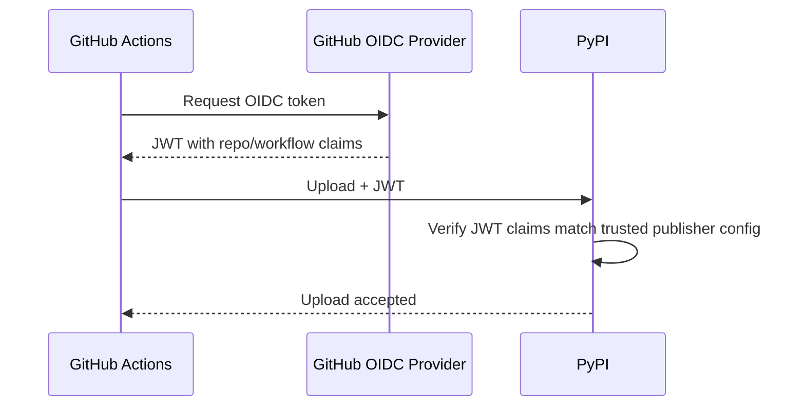

# Publishing mlflow-widgets to PyPI

My first-time PyPI publish. Notes and learnings for future reference.

## Overview


## 1. Account Setup

### PyPI

1. Create account at <https://pypi.org/account/register/>
2. Enable 2FA (required for new accounts)
3. No need to pre-register the package name -- first upload claims it

### TestPyPI

1. Create **separate** account at <https://test.pypi.org/account/register/>
2. TestPyPI is a completely independent instance (different credentials)

## 2. Trusted Publishing (Recommended)

PyPI supports OIDC-based "Trusted Publishing" so GitHub Actions can publish
without storing long-lived API tokens.

### Setup Steps

On **PyPI** (or TestPyPI), go to:
**Account Settings -> Publishing -> Add a new pending publisher**

Fill in:
- **PyPI Project Name**: `mlflow-widgets`
- **Owner**: `daviddwlee84`
- **Repository name**: `mlflow-widgets`
- **Workflow name**: `publish.yml`
- **Environment name**: `pypi` (or `testpypi` for TestPyPI)

On **GitHub**, create matching environments:
- Repository Settings -> Environments -> New environment
- Create `pypi` and `testpypi` environments
- Optionally add protection rules (e.g., required reviewers for `pypi`)

### How It Works



The workflow needs `permissions: id-token: write` to request the OIDC token.
`uv publish` handles the token exchange automatically.

## 3. License Metadata (PEP 639)

### Old Way (Deprecated)

```toml
license = { text = "MIT" }
# or
license = { file = "LICENSE" }

classifiers = [
    "License :: OSI Approved :: MIT License",
]
```

### New Way (PEP 639 / Metadata 2.4+)

```toml
license = "MIT"                  # SPDX expression string
license-files = ["LICENSE"]      # explicit file listing

# Do NOT include License :: classifiers -- they're deprecated
```

Key points:
- `license` is now a plain SPDX expression string, not a table
- `license-files` explicitly lists which files to include
- `License ::` classifiers are deprecated and may cause warnings
- References: [PEP 639](https://peps.python.org/pep-0639/),
  [Core Metadata Spec](https://packaging.python.org/en/latest/specifications/core-metadata/#license-expression)

## 4. Building with uv

```bash
# Build sdist + wheel
uv build

# Build without tool.uv.sources (recommended for publish verification)
uv build --no-sources

# Build only wheel
uv build --wheel

# Output goes to dist/
```

### Verify the Build

```bash
# Check metadata is valid
uv run twine check --strict dist/*

# Inspect wheel contents
unzip -l dist/*.whl

# Should contain:
#   mlflow_widgets/__init__.py
#   mlflow_widgets/chart.py
#   mlflow_widgets/table.py
#   mlflow_widgets/parallel.py
#   mlflow_widgets/selector.py
#   mlflow_widgets/py.typed
#   mlflow_widgets/static/mlflow-chart.js
#   mlflow_widgets/static/mlflow-table.js
#   mlflow_widgets/static/mlflow-parallel.js
#   mlflow_widgets-0.1.0.dist-info/METADATA
#   mlflow_widgets-0.1.0.dist-info/licenses/LICENSE
```

## 5. Publishing

### First Time: Manual with Token

If Trusted Publishing pending publisher is not set up yet:

```bash
# TestPyPI
uv publish --publish-url https://test.pypi.org/legacy/ --token pypi-AgEI...

# PyPI
uv publish --token pypi-AgEI...
```

Generate tokens at:
- PyPI: Account Settings -> API tokens -> Add API token (scope: entire account for first upload)
- TestPyPI: Same flow on test.pypi.org

### Subsequent: Automated via GitHub Actions

```bash
# Publish to TestPyPI (manual trigger)
# Go to Actions -> "Publish to PyPI" -> Run workflow -> target: testpypi

# Publish to PyPI (tag trigger)
git tag v0.1.0
git push origin v0.1.0
# Workflow triggers automatically
```

### Verify TestPyPI Upload

```bash
# Install from TestPyPI (use --extra-index-url for dependencies from real PyPI)
uv pip install \
    --index-url https://test.pypi.org/simple/ \
    --extra-index-url https://pypi.org/simple/ \
    mlflow-widgets

# Quick smoke test
python -c "from mlflow_widgets import MlflowChart; print('OK')"
```

## 6. Version Management

```bash
# Check current version
uv version

# Set explicit version
uv version 0.2.0

# Bump semantically
uv version --bump patch    # 0.1.0 -> 0.1.1
uv version --bump minor    # 0.1.0 -> 0.2.0
uv version --bump major    # 0.1.0 -> 1.0.0

# Preview without changing
uv version 0.2.0 --dry-run
```

## 7. Release Checklist

For each new release:

- [ ] Update version: `uv version --bump <patch|minor|major>`
- [ ] Update CHANGELOG (if maintaining one)
- [ ] Run tests: `uv run pytest tests/ -v`
- [ ] Build: `uv build --no-sources`
- [ ] Check metadata: `uv run twine check --strict dist/*`
- [ ] (Optional) Test on TestPyPI first via workflow_dispatch
- [ ] Commit, push, tag: `git tag v<version> && git push origin v<version>`
- [ ] Verify PyPI page: <https://pypi.org/project/mlflow-widgets/>
- [ ] Verify install: `uv pip install mlflow-widgets==<version>`

## 8. CI/CD Workflow Summary

### ci.yml (on push/PR to main)

1. Matrix: Python 3.10, 3.11, 3.12, 3.13
2. `uv sync --extra dev`
3. `uv run pytest tests/ -v`
4. `uv build --no-sources`
5. `uv run twine check --strict dist/*`
6. Install wheel and verify import

### publish.yml (on v* tag or manual dispatch)

1. Build + twine check + upload artifacts
2. TestPyPI job: triggered by workflow_dispatch with target=testpypi
3. PyPI job: triggered by v* tag push
4. Both use Trusted Publishing (OIDC) -- no stored tokens

## 9. Troubleshooting & Lessons Learned (v0.1.0 Release)

### Issue: `uv run twine` fails in publish workflow

**Symptom**: Build job in `publish.yml` failed with `Failed to spawn: twine`.

**Root cause**: The publish workflow doesn't install the project's dev dependencies
(`uv sync --extra dev`), so `twine` isn't available. Unlike `ci.yml` which syncs
dev deps, the publish workflow only builds.

**Fix**: Use `uvx twine check --strict dist/*` instead of `uv run twine check ...`.
`uvx` runs twine as a standalone tool in an ephemeral environment.

**Takeaway**: `uv run <tool>` requires the tool in project deps; `uvx <tool>` runs
it standalone. Use `uvx` for one-off tool usage in CI, `uv run` for project-scoped tools.

### Issue: Pending Publisher must be set up BEFORE first upload

For Trusted Publishing via OIDC, you must register the pending publisher on
PyPI/TestPyPI **before** the first upload attempt. The project doesn't need to
exist yet -- that's the whole point of "pending" publishers.

### Gotcha: TestPyPI and PyPI are separate

- Separate accounts, separate tokens, separate pending publishers
- TestPyPI has a separate index URL (`https://test.pypi.org/simple/`)
- When installing from TestPyPI, you need `--extra-index-url https://pypi.org/simple/`
  to resolve dependencies that only exist on real PyPI

### Verification pattern with uv

```bash
# Quickest way to verify a published package:
uv run --no-project --with "mlflow-widgets==0.1.0" -- python -c "
  from mlflow_widgets import MlflowChart
  import mlflow_widgets
  print(mlflow_widgets.__version__)
"
```

### Timeline (2026-04-01)

```mermaid
gantt
    title v0.1.0 Release Timeline
    dateFormat HH:mm
    section Preparation
        Update metadata (PEP 639)     :done, 11:00, 5min
        Add test suite (24 tests)      :done, 11:05, 5min
        Add CI/CD workflows            :done, 11:10, 3min
        Write publishing notes         :done, 11:13, 5min
    section Publishing
        Push to GitHub + CI passes     :done, 11:13, 5min
        Fix twine in publish workflow  :done, 11:21, 2min
        TestPyPI publish + verify      :done, 11:22, 5min
        PyPI publish + verify          :done, 11:30, 5min
```



## Key References

- [uv: Building and publishing](https://docs.astral.sh/uv/guides/package/)
- [PEP 639: License-Expression](https://peps.python.org/pep-0639/)
- [PyPI Trusted Publishing](https://docs.pypi.org/trusted-publishers/)
- [GitHub Actions publishing guide](https://packaging.python.org/en/latest/guides/publishing-package-distribution-releases-using-github-actions-ci-cd-workflows/)
- [Core Metadata Spec](https://packaging.python.org/en/latest/specifications/core-metadata/)
- [Writing pyproject.toml](https://packaging.python.org/en/latest/guides/writing-pyproject-toml/)
- [TestPyPI usage guide](https://packaging.python.org/en/latest/guides/using-testpypi/)
